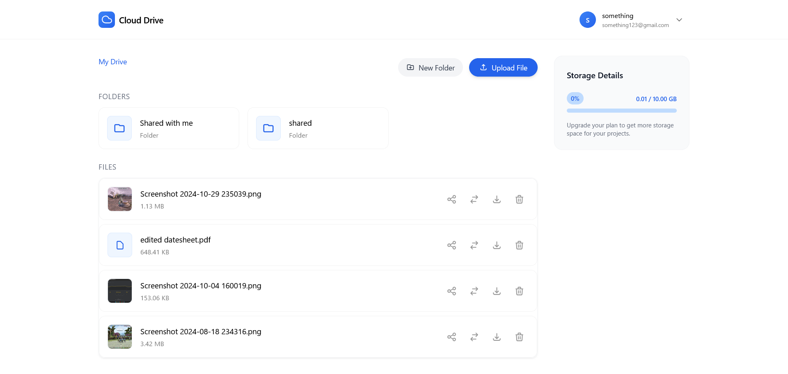

# Google Drive Clone

A full-stack file storage and management platform. Users can upload files, organize them into folders, and share resources with others — all through a clean React frontend backed by a Node.js REST API deployed on AWS EC2.

**Frontend:** [Vercel](https://google-drive-clone-virid.vercel.app)  
**Backend API:** [AWS EC2](https://term-urw-sport-radio.trycloudflare.com/api/v1/)


---

## Screenshots

### Dashboard


### File Upload


### Folder View


### Shared Files


---

## Tech Stack

| Layer | Tech |
|-------|------|
| Frontend | React.js |
| Backend | Node.js, Express.js |
| Database | MongoDB + Mongoose |
| Storage | Cloudinary |
| Auth | JWT |
| DevOps | Docker, GitHub Actions (CI/CD), AWS EC2 |

---

## Features

- **Authentication** — Register and log in with JWT-based session management
- **File Management** — Upload, view, and delete files stored on Cloudinary
- **Folder Management** — Create, rename, and delete folders
- **Sharing** — Share files and folders with other registered users
- **Security** — Rate limiting, input validation, secure password hashing

---

## API Overview

Base URL: `/api/v1`

### Users
| Method | Endpoint | Description |
|--------|----------|-------------|
| POST | `/users/register` | Register a new user |
| POST | `/users/login` | Login and receive a JWT |
| GET | `/users/current-user` | Get logged-in user details |
| POST | `/users/change-password` | Update password |
| PATCH | `/users/update-account-details` | Update profile info |

### Files
| Method | Endpoint | Description |
|--------|----------|-------------|
| POST | `/file/upload` | Upload a file |
| GET | `/file/` | List all files |
| DELETE | `/file/:fileId` | Delete a file |

### Folders
| Method | Endpoint | Description |
|--------|----------|-------------|
| POST | `/folder/createFolder` | Create a folder |
| GET | `/folder/list` | List all folders |
| PATCH | `/folder/:folderId/rename` | Rename a folder |
| DELETE | `/folder/:folderId` | Delete a folder |

### Shared Access
| Method | Endpoint | Description |
|--------|----------|-------------|
| POST | `/shared/share` | Share a file or folder |
| GET | `/shared/user-resources` | View files shared with you |

Health check: `GET /healthz` → returns `"ok"`

---

## Local Setup

### Prerequisites
- Node.js v18+
- MongoDB (local or Atlas)
- Cloudinary account

### Steps

1. Clone the repo
   ```sh
   git clone https://github.com/Deepanshu902/Google-Drive-Clone.git
   cd Google-Drive-Clone
   ```

2. Install dependencies
   ```sh
   # Backend
   cd backend
   npm install

   # Frontend
   cd ../frontend
   npm install
   ```

3. Set up environment variables  
   Create a `.env` file in the `backend` folder:
   ```env
   PORT=8000
   MONGODB_URI=your_mongodb_uri
   JWT_SECRET=your_jwt_secret
   CLOUDINARY_CLOUD_NAME=your_cloud_name
   CLOUDINARY_API_KEY=your_api_key
   CLOUDINARY_API_SECRET=your_api_secret
   ```

4. Run locally
   ```sh
   # Backend
   cd backend
   npm run dev

   # Frontend
   cd frontend
   npm run dev
   ```

---

## CI/CD

Every push to `main` triggers a GitHub Actions workflow that SSHs into the AWS EC2 instance and redeploys the updated backend automatically.

---

## License

MIT License